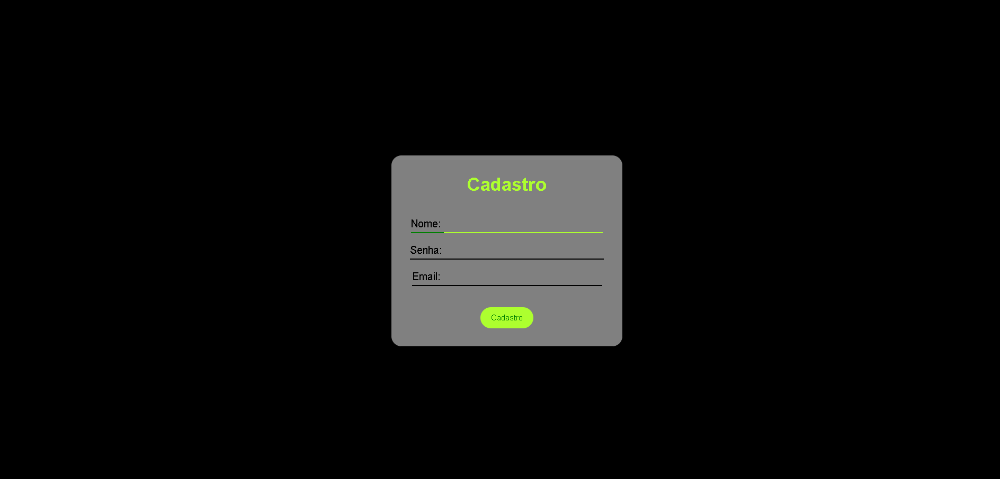
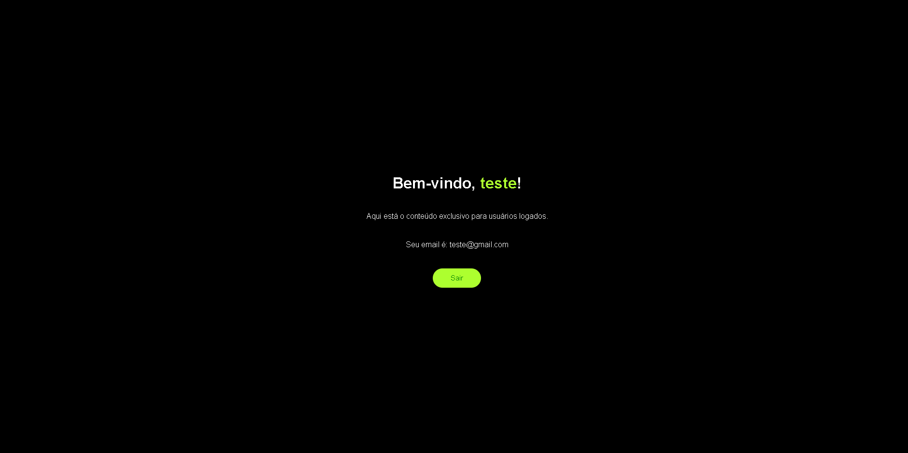

# Banco de dados, para cadastro de Usuario

Descrição do que o projeto faz:

### Site com três páginas:

- Página Home:
O conteúdo desta página depende do status do usuário.

Caso não esteja logado, a página solicitará que o usuário faça login ou se cadastre.

Caso esteja logado, a página cumprimentará o usuário pelo nome cadastrado, exibirá seus dados conforme registrados no banco de dados e oferecerá a opção de logout.

- Página de Login:
Esta página solicita os dados de login do usuário para verificar as informações no banco de dados.

Se os dados forem válidos e o usuário estiver cadastrado, ele será redirecionado para a página Home.

Caso contrário, será exibida uma mensagem de erro.

A página de Login também possui um link para a página de Cadastro.

- Página de Cadastro:
Contém um formulário que deve ser preenchido com os dados do usuário, incluindo uma senha que precisa atender a certos critérios.

Os dados informados serão validados.

Em caso de sucesso no cadastro, o usuário será redirecionado automaticamente para a página Home.

## 🚀 Tecnologias utilizadas

- HTML
- CSS
- JavaScript
- PHP
- Banco de Dados
- MySQL

## 💡 Funcionalidades

- Cadastro de usuários
- Validação de dados e de senha
- Autenticação com sessão
- Layout responsivo
- Redirecionamento
  
## 📷 Demonstração

Prints do site:
<div align="center">
  
  
</div>
<div align="center">
  
  
</div>
<div align="center">
  
</div>

## 📦 Como rodar o projeto

```bash
# Clone este repositório
git clone https://github.com/thalezv/form-mysql.git

# Acesse a pasta do projeto
cd nome-do-repositorio

```
Basta abrir um servidor local com a pasta do repositorio dentro da pasta do servidor, e integrar o banco de dados presente no repositorio com o servidor local.

## 🧠 Aprendizados

- Autenticação de usuários com PHP e MySQL

  **1.** Validação de login e senha com verificação no banco de dados.

  **2.** Cadastro de novos usuários com validação de campos e senhas seguras.

  **3.** Gerenciamento de sessões para manter usuários logados.

- Criação de páginas dinâmicas

  **1.** Exibição de conteúdo condicional (diferente para usuários logados ou não).

  **2.** Redirecionamentos automáticos com base no estado de login.

- Estrutura de um sistema web básico

  **1.** Separação clara entre páginas: Home, Login e Cadastro.

  **2.** Boas práticas de fluxo do usuário (UX).

- Segurança básica em aplicações web

  **1.** Proteção de rotas com verificação de sessão.

  **2.** Tratamento de erros de login/cadastro.

  **3.** Uso de hash de senha (caso implemente password_hash/verify).

- Interação com banco de dados

  **1.** Conexão e consultas ao MySQL com PDO ou mysqli.

  **2.** Inserção, leitura e comparação de dados.

## 📄 Licença
Este projeto está sob nenhuma licença — sinta-se à vontade para usar.

# 🙋‍♂️ Autor
Feito por Thales Tenório de Medeiros( [Site Portfolio](https://thalestm.tech/))

Entre em contato se quiser trocar ideias ou sugestões!
